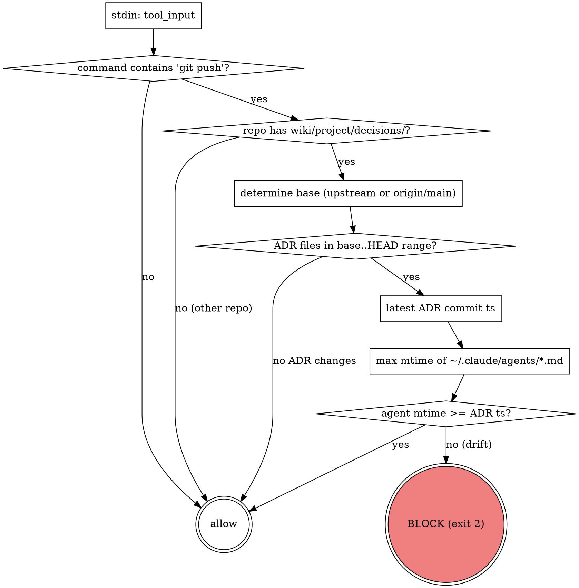

# ADR ↔ Agent prompt sync hook

**TL;DR:** Claude Code `PreToolUse` hook на Bash. Срабатывает перед `git push`. Если в пушимых коммитах изменялся любой `llm-wiki/wiki/project/decisions/NNNN-*.md`, то mtime хотя бы одного `~/.claude/agents/*.md` должен быть ≥ времени последнего ADR-коммита. Иначе push блокируется. Операционализация ADR [[../decisions/0017-review-agent-harness]].

## Purpose

Review-агенты (`trading-logic-reviewer`, `quant-stats-reviewer`, `data-integrity-reviewer`, `python-reviewer`) хранят в своих prompt'ах привязки к конкретным ADR: Kelly phases (ADR 0012), Wilder vs classical (ADR 0011), WFA params (ADR 0014), slippage model (ADR 0010), circuit breakers (ADR 0013). Когда ADR меняется, prompt агента должен быть обновлён синхронно — иначе ревью будет опираться на устаревшие формулы и пропустит баг.

Ручной sync-чек был описан в `llm-wiki/CLAUDE.md` как "часть workflow `finishing-a-development-branch`". На практике такие чек-листы забываются. Hook делает проверку **обязательной** через блокировку push.

## Files

- Script: `~/.claude/hooks/adr-agent-sync-check.sh` — bash, +x.
- Registration: `~/.claude/settings.json`, `hooks.PreToolUse[].matcher="Bash"` →
  `command="$HOME/.claude/hooks/adr-agent-sync-check.sh"`.
- Agents directory (watched): `~/.claude/agents/`.
- ADR directory (watched): `llm-wiki/wiki/project/decisions/` (relative to repo root).

## Hook contract

Claude Code passes JSON on stdin:

```json
{ "tool_input": { "command": "git push origin feature/sprint-4" } }
```

Exit codes:

| Code | Meaning |
|---|---|
| `0` | allow the tool call |
| `2` | **block** the tool call; stderr shown to the user |
| other non-zero | fail open (Claude Code proceeds) |

## Algorithm



## Fail-open policy

Hook **намеренно** fail-open в следующих случаях:
- `python3` отсутствует или payload malformed (редкое — macOS ships with python3).
- Команда не содержит `git push`.
- Текущая директория не git repo или не имеет `llm-wiki/wiki/project/decisions/` (значит, это не наш проект).
- Нет upstream и нет `origin/main` (первый клон без remote).
- `git log base..HEAD` не нашёл ADR-изменений.

Fail-**closed** (exit 2 + stderr + block) только когда:
- ADR-коммит есть в диапазоне пуша.
- `~/.claude/agents/` не существует или пуст.
- max mtime агентов **строго меньше** времени последнего ADR-коммита.

Принцип: лучше пропустить edge case, чем сломать работу пользователя в неродственных репах.

## Acknowledge flow (если ADR не требует agent-update)

Если ADR не затрагивает ни одного агента (например, чисто организационный — 0001 "use ADR format"), пользователь подтверждает:

```bash
touch ~/.claude/agents/trading-logic-reviewer.md
git push
```

Это продвигает mtime выше времени ADR-коммита, и hook пропускает push. Это явный ack, а не обход.

## Output example (блокировка)

```
🚫  ADR ↔ Agent prompt sync check FAILED

ADR files changed in commits being pushed:
    - llm-wiki/wiki/project/decisions/0017-review-agent-harness.md

Latest ADR commit time:    2026-04-22 21:15:03 +04
Latest agent prompt mtime: 2026-04-22 20:54:11 +04

Agent prompts in /Users/Apple/.claude/agents/ have not been updated since the ADR change.

Required action — one of:
  1) Update the relevant reviewer prompt(s) under ~/.claude/agents/ so they
     reflect the new ADR (e.g. new Kelly phases, new reason codes,
     changed walk-forward params), then retry push.
  2) If the ADR change does not affect any agent prompt, acknowledge by
     touching any prompt to advance its mtime:
         touch ~/.claude/agents/trading-logic-reviewer.md
     then retry push.

(Defined by: llm-wiki/wiki/project/components/adr-agent-sync-hook.md
 Policy:     ADR 0017 — review-agent harness)
```

## Caveats

- **Cross-platform:** скрипт использует `stat -f` (BSD/macOS) и `find -printf` (GNU/Linux) через `uname`-гейт. Windows не поддерживается (у пользователя macOS).
- **mtime ≠ семантический sync.** Пользователь может открыть агент в редакторе без изменений и сохранить — mtime обновится, hook пропустит. Но это сознательный trade-off: автоматически определить "реальный" sync невозможно без manifest'а, а manifest — over-engineering до первого инцидента.
- **Worktree scope.** Hook срабатывает при push из любого worktree проекта (все они видят `llm-wiki/wiki/project/decisions/`). Этого достаточно для v0.1.
- **Для второго репозитория.** Если понадобится расширить (например, агенты для второго проекта), добавить per-project `.claude/settings.json` с своим hook-скриптом. Текущая реализация глобальная через `~/.claude/settings.json`.
- **Hook self-test guard (added 2026-04-25):** PreToolUse matcher `"Bash"` triggers hook на ANY Bash invocation. Test commands (`echo '{"tool_input":{"command":"git push ..."}}' | bash hook.sh`) substring-matched `"git push"` через `case` pattern → false-positive blocks. Guard skips if `$command_str` references hook script paths (`adr-agent-sync-check.sh` ИЛИ `adr-index-sync-check.sh` ИЛИ `hooks/*sync-check*`). Real `git push` commands не reference hook scripts, so guard is safe. См. `~/.claude/hooks/adr-agent-sync-check.sh:42-49`.

## Verification

Manual tests (прошли 2026-04-22):
- `echo '{"tool_input":{"command":"ls"}}' | hook` → exit 0 (non-push ignored).
- `echo '{"tool_input":{"command":"git push"}}' | hook` в worktree без committed ADR → exit 0 (нет ADR в range).
- Fail-closed ветка проверяется при первом реальном ADR-коммите.

## Referenced by

- [[../architecture/development-workflow]] — PHASE 8 step 4 (ADR ↔ agent prompt sync invariant)
- [[../../CLAUDE]] (llm-wiki/CLAUDE.md) — "ADR ↔ agent prompts" sync section
- [[../decisions/0017-review-agent-harness]] — defining ADR (review-agent harness operationalized by this hook)
- [[adr-index-sync-hook]] — sister hook (parallel pattern, mirror of this)

## Related

- ADR: [[../decisions/0017-review-agent-harness]] — политика, агенты.
- Config: `~/.claude/settings.json` (PreToolUse hook registration).
- Agents: `~/.claude/agents/{trading-logic-reviewer,quant-stats-reviewer,data-integrity-reviewer,Python Reviewer}.md`.
- Workflow: [[../architecture/development-workflow]] — Superpowers review gate.
